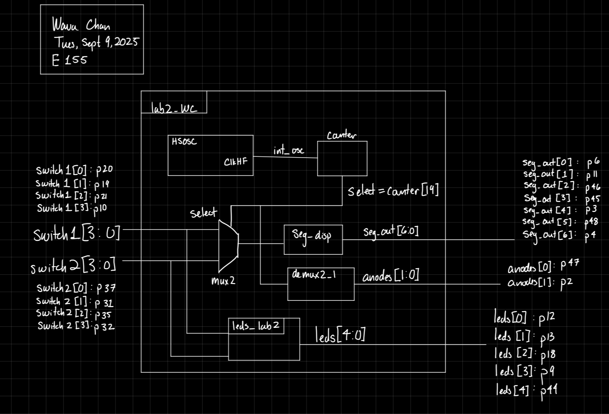
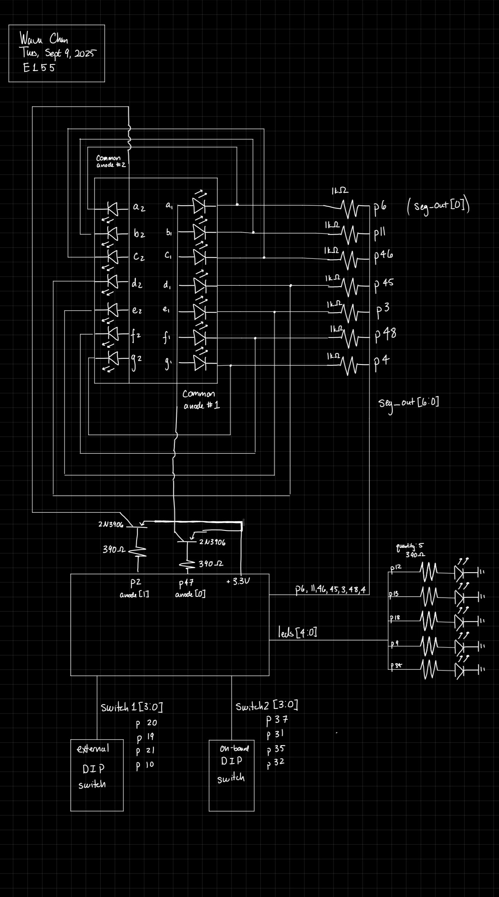
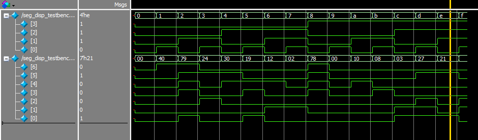
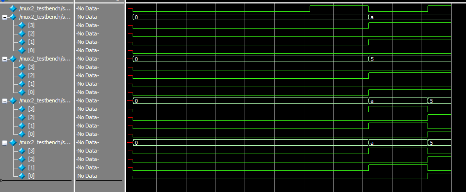
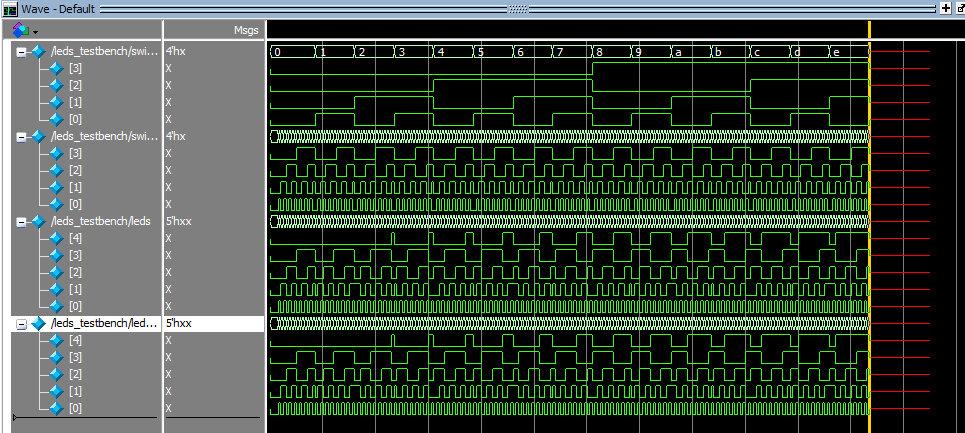
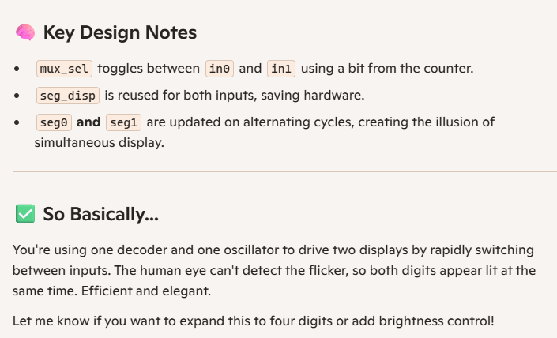

# Introduction 

The goal of Lab 2 was to design a system (circuit and code) that included a dual 7-segment display, each displaying a hex number, and 5 leds, which would show the sum of the two displayed digits in binary. Given the limited number of pins on the FPGA board, the displays had to be driven by a single set of pins, and rely on time multiplexing to (very quickly) switch between the two displays, so that it seemed like both were on simultaneously. 

The input to the displays was provided by two DIP switches. 

# Design & Testing

## Hardware

The circuit used all the FPGA pins, so there had to be multiplexing between the two displays to correctly display different values at the same time. This was done by driving either (not both) of the common anodes, turning each display on in turn, at a higher frequency than the human eye can detect. 

The base rate for this detection os 40Hz, so 46.2 Hz was chosen to oscillate at. 

The common anode pins on the display were connected to FPGA pins, but these do not provide enough voltage to drive the pin. Thus, the signal to the pins was bolstered by a PNP transistor. 

An external (off-board) DIP switch was also connected to the FPGA. The five LEDs used to display the output were also connected FPGA pins, in series with 390ohm resistors. 

Overall, the pin assignment is as seen below:

### Pin Assignment

| logic       | pin   |
|-------------|--------|
| switch1[0]  |  p20   |
| switch1[1]  |  p19   |
| switch1[2]  |  p21   |
| switch1[3]  |  p10   |
| switch2[0]  |  p37   |
| switch2[1]  |  p31   |
| switch2[2]  |  p35   |
| switch2[3]  |  p32   |
| seg_out[0]  |  p6    |
| seg_out[1]  |  p11   |
| seg_out[2]  |  p46   |
| seg_out[3]  |  p45   |
| seg_out[4]  |  p3    |
| seg_out[5]  |  p48   |
| seg_out[6]  |  p4    |
| anodes[0]   |  p47   |
| anodes[1]   |  p2    |
|  leds[0]    |  p12   |
|  leds[1]    |  p13   |
|  leds[2]    |  p48   |
|  leds[3]    |  p9    |
|  leds[4]    |  p44   |

: Pin Assignment {.striped .hover}

## Software

This system had five modules: 

1. Lab2_wc: This was the main top module
2. seg_disp: Combination logic to dictate which segments would turn on
3. Mux (2 to 1): used to select between the two input switches
4. Deselect: write to one anode or the other
5. LED driver: calculate and assign output to the LED pins

The design was tested using QuestaSim simulations, detailed below in the Results and Discussion section. 


# Technical Documentation 

The code for the project can be found in this [Github repository](https://github.com/wchan03/e155Lab2)

### Lab2_wc

```

// Wava Chan
// wchan@g.hmc.edu
// Sept. 4, 2025
// Top Level Module for Lab 2: Mutiplexed 7-Seg Display

module lab2_wc( input logic [3:0] switch1, 
				input logic [3:0] switch2, // Two DIP switches
                output logic [6:0] seg_out,
				output logic [4:0] leds, 
				output logic [1:0] anodes); // Writing to the anodes
				
				logic select; //0 for display 0, 1 for display 1
				logic [3:0] switch; // Selected switch data
				logic int_osc; // internal clock
                logic [19:0] counter;
			
				//Create clock 
				// Internal high-speed oscillator
				HSOSC #(.CLKHF_DIV(2'b01)) 
					hf_osc (.CLKHFPU(1'b1), .CLKHFEN(1'b1), .CLKHF(int_osc));

				// Counter
				always_ff @(posedge int_osc) begin  
					counter <= counter + 19'd2; //operates at ~46.2 Hz
				end
				
                // Google AI says the human eye can detect up to 40Hz of flickering so started there
				// Select is based on the clock
                assign select = counter[19];
				
				// Select input
				mux2 in(switch1, switch2, select, switch); 

                // Segment Display Module
				seg_disp sd(switch, seg_out); // Calculate segments 
				
				// Select output 
				//write HIGH to common anode 1 or common anode 2, depending on select
				demux2_1 dm(select, anodes); 
				
				// LEDs calculation from switch 1 and switch 2 and LED assignment
				leds_lab2 sum(switch1, switch2, leds);

 endmodule 

 ```

 ### seg_disp

 ```

 // Wava Chan 
// wchan@g.hmc.edu 
// Aug. 29, 2025 
// seg_disp determines which segments must be turned on for each hexidec digit

module seg_disp(input logic [3:0] s, 
				output logic [6:0] seg ); 
				
	logic [6:0] seg_intm;
	
	always_comb begin 
		// seg[0] is A 
		// seg[6] is G 
		case(s)
			4'b0000: seg_intm <= 7'b0111111; //0
			4'b0001: seg_intm <= 7'b0000110; //1 
			4'b0010: seg_intm <= 7'b1011011; //2 
			4'b0011: seg_intm <= 7'b1001111; //3 
			4'b0100: seg_intm <= 7'b1100110; //4 
			4'b0101: seg_intm <= 7'b1101101; //5 
			4'b0110: seg_intm <= 7'b1111101; //6 
			4'b0111: seg_intm <= 7'b0000111; //7 
			4'b1000: seg_intm <= 7'b1111111; //8 
			4'b1001: seg_intm <= 7'b1101111; //9 
			4'b1010: seg_intm <= 7'b1110111; //A 
			4'b1011: seg_intm <= 7'b1111100; //B 
			4'b1100: seg_intm <= 7'b1011000; //C 
			4'b1101: seg_intm <= 7'b1011110; //D 
			4'b1110: seg_intm <= 7'b1111001; //E 
			4'b1111: seg_intm <= 7'b1110001; //F 
			default: seg_intm <= 7'b1111111;
		endcase 
		
		seg <= ~seg_intm; // Flip all bits to pull segments DOWN to turn them on 
	end
endmodule

```

 ### Mux

 ```
 // Wava Chan
// wchan@g.hmc.edu
// Sept. 5, 2025
// Basic 2-in 1-out mux

module mux2 #(parameter WIDTH = 4)
			(input logic [WIDTH-1:0] d0, d1,
			input logic s,
			output logic [WIDTH-1:0] out);
			
	assign out = s ? d1 : d0;
	
 endmodule 
 ```

 ### Deselect

 ```
 // Wava Chan
// wchan@g.hmc.edu
// Sept. 5, 2025
// Basic demux 1 in 2 out for Lab 2

module demux2_1(input logic select,
				output logic [1:0] com_an); //Common Anode
	
	always_comb begin
		case(select)
			1'b0: com_an = 2'b10; // turn on common anode 1
			1'b1: com_an = 2'b01; // turn on common anode 2
			default: com_an = 2'b00;
		endcase
	end
endmodule
```

 ### LED Driver

  ```
// Wava Chan
// wchan@g.hmc.edu
// Sept. 5, 2025
// Calculate sum of two switch values and write to LEDs

module leds_lab2(input logic [3:0] switch1, switch2, 
				output logic [4:0] leds);
	logic [4:0] total; // Values from two switches added together
	
	//Calculate total 
	assign total = switch1 + switch2; 
	
	// Assign LEDs appropriately
	assign leds = total;
				
endmodule
 ```

## Schematic



## Block Diagram



# Results and Discussion 

The design met all the design objectives. The frequency of the toggling was a little slow, and could be picked up by the human eye on occasion, but this is an easy fix. (I just had trouble re-programming my board)

## Testbench Simulations

In terms of testing, each of the modules was tested individually. The lower level modules (2-5) were tested to ensure their logical functionality, while the top module (Lab2_wc) was tested to ensure the correct toggling. 

### Lab2_wc

The output of the toggling was tested/validated using this code:

```
//Wava Chan
//wchan@g.hmc.edu
//Sept. 7, 2025
//Overall testing of top-level module

`timescale 1ns/1ps

//`define ASSERT() assert else $error

module lab2_testbench();

    logic clk, reset;
    logic [3:0] switch1, switch2;
    logic [6:0] seg_out;
    logic [4:0] leds;
    logic [1:0] anodes;
 

    //Instantiate dut. Operates at 46.2Hz
    lab2_wc dut(switch1, switch2, seg_out, leds, anodes);

	// Generate clock 
	always 
		begin 
			clk = 1; #43290045; clk = 0; #43290045;
		end 
		
    initial begin
        dut.counter = 0;
        // check assertions
        switch1 = 4'b0101
        switch2 = 4'b1000
        //seg_out = 1110001, leds = 01111
        //check if only one or the other is high
        assert 
            property (@(posedge clk) anodes[0] |-> (anodes[1] == 0))
            else $error ("not toggling");
        $finish
    end


endmodule
```


### seg_disp

This was tested last lab, but verified again this lab. 



### Mux

A simple testbench was created, and the output is as seen below: 



### Deselect

A simple testbench was created, and the code is as seen below: 

```
// Wava Chan
// wchan@g.hmc.edu
// Sept. 8, 2025
// Testbench for the lab 2 demux module

module mux2_testbench();
    logic clk, reset, select;
    logic [1:0] anode_out, anode_expected;
	
	// 0 selects switch 2, 1 selects switch 1
	//Instantiate device under test
	demux2_1 dut(select, anode_out); 
	
	// Generate clock 
	always 
		begin 
			clk = 1; #5; clk = 0; #5;
		end 
		
	initial
		begin
			select = 1'b0; #1; assert(anode_out == 2'b10) else $error ("for select = 0, error!");
			select = 1'b1; #1; assert(anode_out == 2'b01) else $error ("for select = 1, error!");
			$finish;
		end

endmodule
```
### LED Driver

A simple testbench was created, testing every possible combination of switch inputs, and the output is as seen below: 



# Conclusion 

In this lab, I successfully designed and built a circuit that displayed the hex input of two different DIP switches, as well as showed the sum of those two values via a series of 5 LEDs. I spend 20 hours on this lab

# AI Prototype

For this prototype, I used Microsoft CoPilot instead of ChatGPT. 

CoPiolot produced a fairly simple script, as seen below. It does not include some of the details I included in my code, such as the use of HFOSC . There are two modules: a multiplexer and a decoder.

```
module seven_segment_multiplexer (
    input logic clk,
    input logic rst,
    input logic [3:0] in0,
    input logic [3:0] in1,
    output logic [6:0] seg0,
    output logic [6:0] seg1
);

    // Internal signals
    logic [3:0] current_input;
    logic [6:0] decoded_output;
    logic toggle;

    // Toggle between inputs every clock cycle
    always_ff @(posedge clk or posedge rst) begin
        if (rst)
            toggle <= 0;
        else
            toggle <= ~toggle;
    end

    // Select input based on toggle
    always_comb begin
        current_input = toggle ? in1 : in0;
    end

    // Instantiate decoder
    seven_segment_decoder decoder_inst (
        .bin(current_input),
        .seg(decoded_output)
    );

    // Store decoded output into appropriate register
    always_ff @(posedge clk or posedge rst) begin
        if (rst) begin
            seg0 <= 7'b1111111;
            seg1 <= 7'b1111111;
        end else begin
            if (toggle)
                seg1 <= decoded_output;
            else
                seg0 <= decoded_output;
        end
    end

endmodule

// 4-bit to 7-segment decoder (common anode)
module seven_segment_decoder (
    input logic [3:0] bin,
    output logic [6:0] seg
);
    always_comb begin
        case (bin)
            4'h0: seg = 7'b0000001;
            4'h1: seg = 7'b1001111;
            4'h2: seg = 7'b0010010;
            4'h3: seg = 7'b0000110;
            4'h4: seg = 7'b1001100;
            4'h5: seg = 7'b0100100;
            4'h6: seg = 7'b0100000;
            4'h7: seg = 7'b0001111;
            4'h8: seg = 7'b0000000;
            4'h9: seg = 7'b0000100;
            4'hA: seg = 7'b0001000;
            4'hB: seg = 7'b1100000;
            4'hC: seg = 7'b0110001;
            4'hD: seg = 7'b1000010;
            4'hE: seg = 7'b0110000;
            4'hF: seg = 7'b0111000;
            default: seg = 7'b1111111; // All segments off
        endcase
    end
endmodule
```

This code did indeed synthesize on Lattice.

When I applied the other prompt (while attaching my own code), I receive this code back: 

```
module dual_seg_mux (
    input  logic [3:0] in0,         // First 4-bit input
    input  logic [3:0] in1,         // Second 4-bit input
    output logic [6:0] seg0,        // Output to first display
    output logic [6:0] seg1,        // Output to second display
    output logic [2:0] led          // LED outputs
);

    // Internal oscillator and counter
    logic int_osc;
    logic [32:0] counter;
    logic [3:0] mux_input;
    logic [6:0] seg_out;
    logic mux_sel;

    // Instantiate internal oscillator
    HSOSC #(.CLKHF_DIV(2'b01)) hf_osc (
        .CLKHFPU(1'b1),
        .CLKHFEN(1'b1),
        .CLKHF(int_osc)
    );

    // Instantiate shared segment decoder
    seg_disp sd (
        .s(mux_input),
        .seg(seg_out)
    );

    // Counter for timing and multiplex control
    always_ff @(posedge int_osc) begin
        counter <= counter + 33'd859;
        mux_sel <= counter[15]; // Toggle every ~32k cycles
    end

    // Multiplex input selection
    always_comb begin
        mux_input = mux_sel ? in1 : in0;
    end

    // Drive outputs alternately
    always_ff @(posedge int_osc) begin
        if (mux_sel)
            seg1 <= seg_out;
        else
            seg0 <= seg_out;
    end

    // LED logic (example reuse from original)
    assign led[0] = mux_input[1] ^ mux_input[0];
    assign led[1] = mux_input[3] & mux_input[2];
    assign led[2] = counter[32];

endmodule
```
as well as these comments: 


which also synthesized!

The second code was more complex, and more closely aligned with what my current code looks like, since it is based on previous code. 

