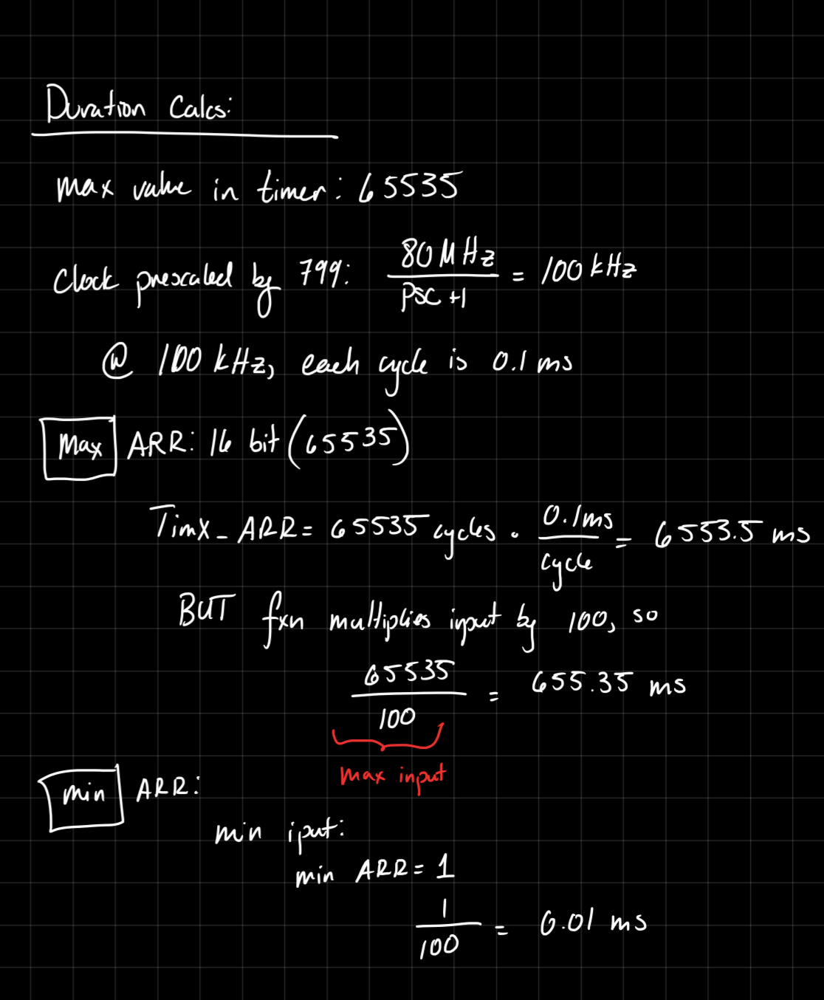
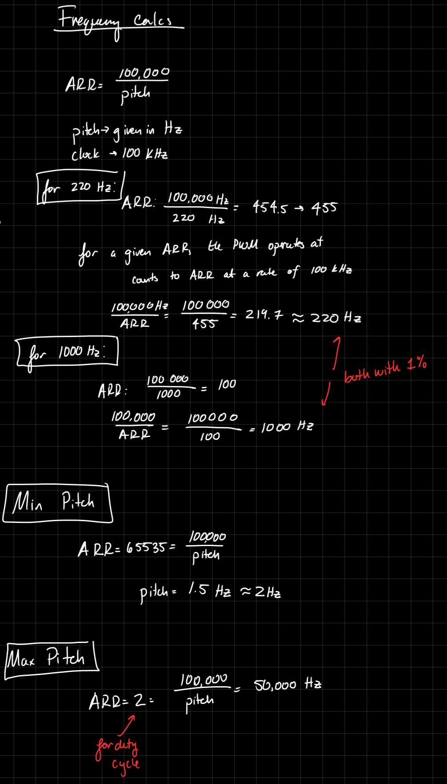
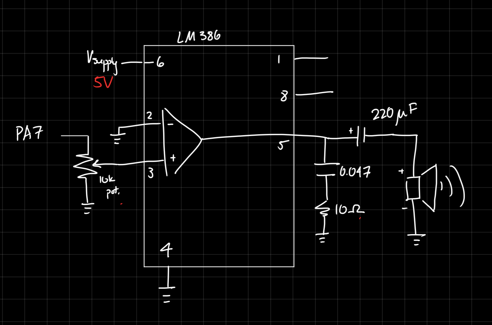
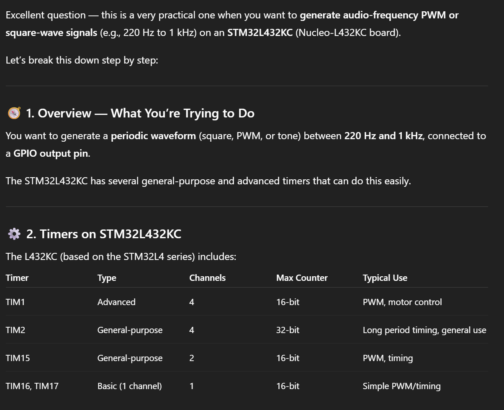
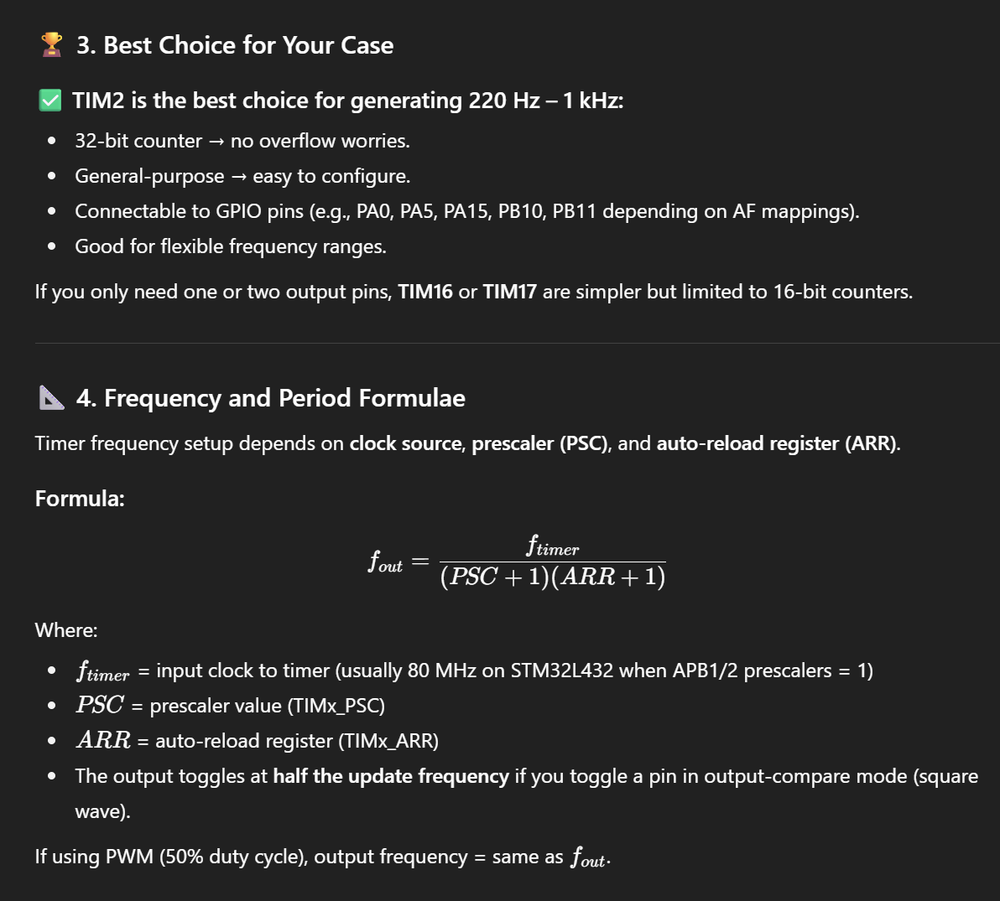
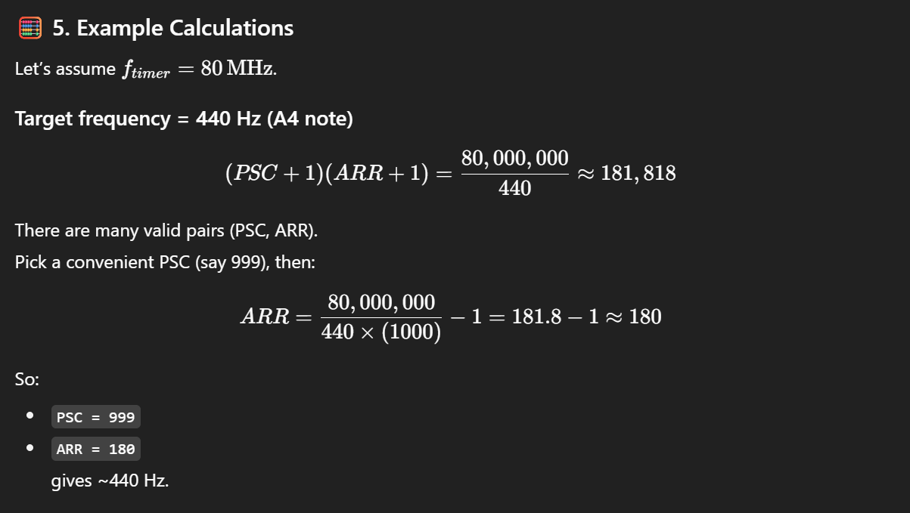
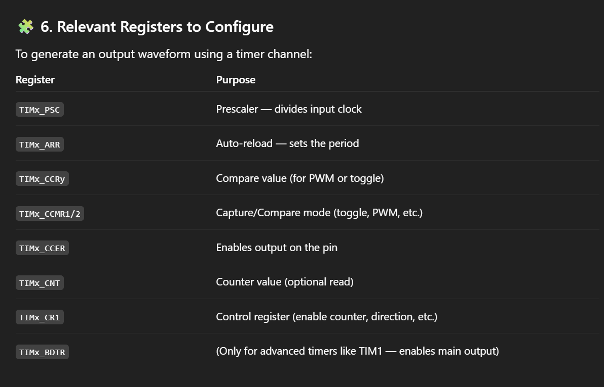
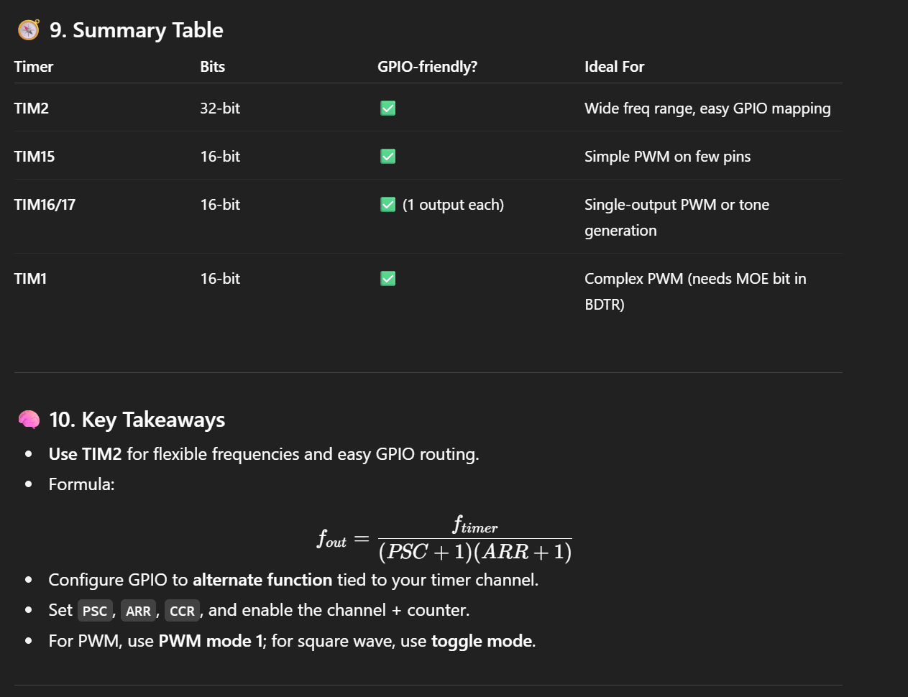

---
Title: "Lab 4"
Author: "Wava Chan"
format: html
--- 

# Introduction

In Lab 4, the MCU was configured to output a signal to a speaker with the intent to play a pre-determined song. Specifically, TIMER15 and TIMER16 were used to produce a square wave, driven to the speaker to play a note, and a delay timer, to play the note for the correct duration. 

Using this methodology, the design is able to play Fur Elise, as well as a version of Hozier's Jackie and Wilson. 

# Design and Testing

## Code

The two components of a note are pitch and duration, both of which were produced by timers present in the MCU.

The signal for the speaker was generated by TIMER15, as it has the capabilties to produce a PWM, or a square wave, with a settable frequency. 

Then, the length of the note was determined by using TIMER16 to produce a delay, measuring in milliseconds. 

To configure both of these timers, first, a library for them was written. This is to easily set all the necessary bits/registers. Then, each note in a given song is played by first setting the pitch/frequency of TIMER15 PWM signal, then delaying by the length of the note, before moving to the next note and starting the process over again. 

The PWM signal was written directly to PA2 (or A7, on the Nucleo Board), by configuring the GPIO pin to use its alternate function: TIM15_CH1 (Timer 15 Channel 1). 

All this is in addition to configuring the system clock to run at 80Mhz (using the PLL clock), and configuring the flash. This was done via provided code. 

## Hardware 

The signal from the Nucleo board (specifically, pin A2). is too small to appropriatley power a speaker. As such, the signal had to be amplified. 

For this lab, the hardware was very simple. The [datasheet](https://www.ti.com/lit/ds/symlink/lm386.pdf) of the LM386 Low Voltage Audio Power Amplifier provides a variety of example circuits with a variety of gains. By following the Gain = 20 application (pg. 10), the circuit schematic was designed. A 10k potentiometer was included for volume control. 

## Testing

Testing was completed by ensuring each of the modules (pitch setter and delay) worked separately, via an oscilliscope.

To ensure the entire range of pitches could be achieved, a range of pitches were calculated to ensure the output pitch would be within 1% of the desired pitch. To more fully test the functionality, all possible frequencies should have the same calculations run. 

Additionally, the maximum and minimum pitch and duration were all calculated. These are limited by the maximum size of the TIMx_ARR register, which is 16 bits, thus having a maximum value of 65,535. The minimum is due to the internal workings of the code. 





# Technical Documentation

The source code for this project can be found [here](https://github.com/wchan03/e155Lab4/tree/main), in the Git Repository. 

## Schematic

The circuit design is as follows. The 



# Results and Discussion 

The design was able to produce the correct notes for the correct duration, as seen in the below video. 

There is a small error with overflow in the pitch_set() function, where the pitch would not update. However, this was resolved by setting the pitch to 0, then writing the next desired pitch. 

# Conclusion

Overall, the design played the desired song through a speaker, and was able to be adjusted for volume. The TIMER library allowed timers TIMER15 and TIMER16 to be enabled to the lab specifications. 

I spent a total of 30hrs working on this lab. 

# AI Prototype

I used ChatGPT, and copied in the prompt: 

What timers should I use on the STM32L432KC to generate frequencies ranging from 220Hz to 1kHz? What’s the best choice of timer if I want to easily connect it to a GPIO pin? What formulae are relevant, and what registers need to be set to configure them properly?

ChatGPT provided the following output: 





Claiming that TIM2 is the best choice is interesting-- it does indeed have a larger maximum register value, widening the possible range. However, TIM2 is mor complex than TIM15 and TIM16, and simpler is better. 




These calculations are correct, and could be helpful. 

It also provided some helpful starter pseudo-code to produce a square wave: 

```{c}
// Example: Generate 440 Hz square wave on PA0 using TIM2_CH1 (AF1)
RCC->APB1ENR1 |= RCC_APB1ENR1_TIM2EN;     // Enable TIM2 clock
RCC->AHB2ENR  |= RCC_AHB2ENR_GPIOAEN;     // Enable GPIOA clock

// Configure PA0 as AF1 (TIM2_CH1)
GPIOA->MODER   &= ~(3 << (0 * 2));
GPIOA->MODER   |=  (2 << (0 * 2));         // Alternate function mode
GPIOA->AFR[0]  |=  (1 << (0 * 4));         // AF1 = TIM2_CH1

// Timer base configuration
TIM2->PSC = 999;                           // Prescaler
TIM2->ARR = 180;                           // Auto-reload
TIM2->CCR1 = 90;                           // Compare (toggle mid-way)
TIM2->CCMR1 |= (0b011 << TIM_CCMR1_OC1M_Pos); // Toggle on match
TIM2->CCER |= TIM_CCER_CC1E;               // Enable CH1 output
TIM2->CR1 |= TIM_CR1_CEN;                  // Enable counter

```

It also provided some code to enable PWM mode, instead of the above, more manual toggle-based format. 

```{c}
TIM2->CCMR1 &= ~TIM_CCMR1_OC1M;
TIM2->CCMR1 |= (0b110 << TIM_CCMR1_OC1M_Pos); // PWM mode 1
TIM2->CCMR1 |= TIM_CCMR1_OC1PE;               // Preload enable
TIM2->CCR1 = TIM2->ARR / 2;                   // 50% duty
TIM2->CCER |= TIM_CCER_CC1E;
TIM2->CR1 |= TIM_CR1_CEN;
```

Overall, ChatGPT produced some helpful code and insight, but I don't think I would understand it if I didn't do the lab already. Additionally, it makes heavy use of the provided library, which makes sense, but was not permitted in this lab. 

When I tried to attach the reference manual, it was too large for the free version of ChatGPT to parse through. 