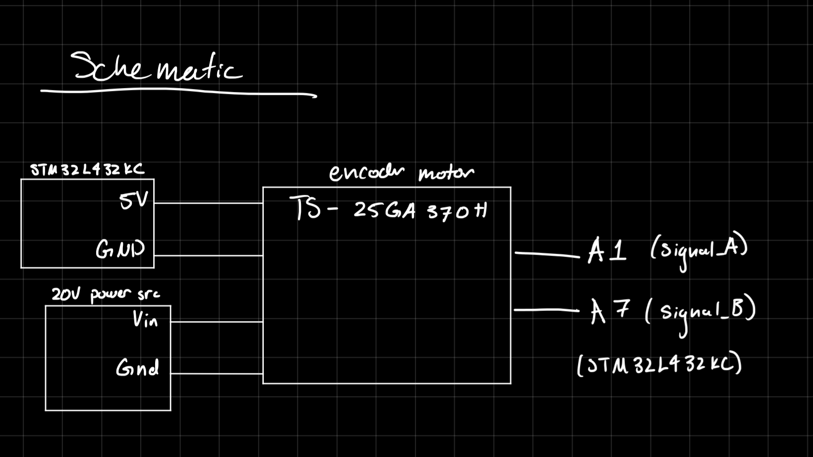
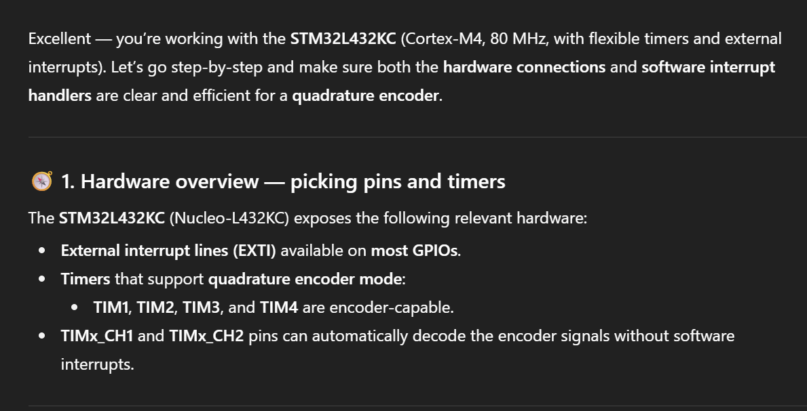
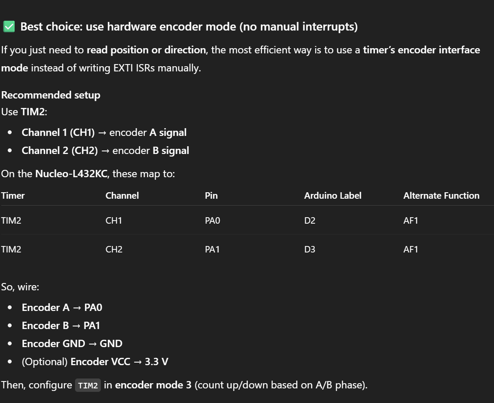

# Introduction

In Lab 5, a quadrature encoder was used to read a motor speed. The decoding of the output signals was performed on the STM32L4 using interrupt-based code. 

# Design and Testing

## Code

The interrupt lines were attached to two GPIO pins, which were connected to quadrature encoder sensors. To configure the interrupt lines, the given STM libraries were used. There was a separate interrupt handler for each of the two signals, where the interrupt was triggered on the rising AND falling edge of the signal. Each time the interrupt was triggered, a global counter was incremented. A timer was also used. 

After a designated period (200ms, determined using the timer), the main function would calculate the speed using the value in the global counter, as well as the value in the timer. After the calculation was made, both the timer and the counter would be reset to 0, and the cycle would start again.

To calculate the speed of the motor, in rev/s, was calculated below.


The direction of the motor was determined using a truth table and corresponding boolean equation, depending on which interrupt, A or B, was triggered. 


The direction calculation happened when the interrupt was triggered, to avoid delay, but the speed calculations happen inside main.

## Hardware 

The encoder was a complete unit that was attached to a power supply (ranging from 0-12V), the 5V pin and ground pin off the board, and two output pins. The power supply drove the motor, the 5V and ground pins drove the sensors, and the two input pins read the output of the sensors. These were connected per the datasheet. The schematic below shows these connections more clearly. 

# Technical Documentation

The code for this solution can be found [here](https://github.com/wchan03/e155Lab5), in the appropriate Git Repository. 

## Schematic



## Flowchart


# Results and Discussion

This design met all the intended requirements. It can read the speed of the motor, as well as the direction. 

## Interrupt vs. Manual Polling

Interrupt-based code will perform faster than manual polling, especially at higher speeds. Interrupts are only triggered when configured to (i.e., when a signal is recieved), meaning that the necessary processes can be performed exactly when necessary. 

Conversely, polling typically involves a loop, and continuous checking of a flag. This is slightly more simple, but comes with multiple drawbacks. Firstly, it does not allow for the CPU to perform any other tasks at the same time. Secondly, since the function must loop through the rest of the code, the CPU might miss the beginning of the signal, and not catch it until the next polling loop. This will cause delays with more complex code or when high speed is necessary. 

# Conclusion

The design was able to successfully read the speed of the motor using all rising and falling edges of the encoder sensor signals.

I spent a total of 10 hours on this lab. 

# AI Prototype

I asked ChatGPT the given prompt: 

Write me interrupt handlers to interface with a quadrature encoder. I’m using the STM32L432KC, what pins should I connect the encoder to in order to allow it to easily trigger the interrupts?

ChatGPT strongly suggests using the TIM2 encoder mode, something I was unaware of. It seems this LLM has a tendancy to infer the point of your code and suggest a "more efficient" way of doing so, bypassing some more nitty-gritty work. 




Here is the code it produced:

```{c}
TIM_HandleTypeDef htim2;

void MX_TIM2_Init(void)
{
    TIM_Encoder_InitTypeDef sConfig = {0};
    TIM_MasterConfigTypeDef sMasterConfig = {0};

    htim2.Instance = TIM2;
    htim2.Init.Prescaler = 0;
    htim2.Init.CounterMode = TIM_COUNTERMODE_UP;
    htim2.Init.Period = 0xFFFF;
    htim2.Init.ClockDivision = TIM_CLOCKDIVISION_DIV1;
    htim2.Init.RepetitionCounter = 0;
    htim2.Init.AutoReloadPreload = TIM_AUTORELOAD_PRELOAD_DISABLE;

    sConfig.EncoderMode = TIM_ENCODERMODE_TI12;
    sConfig.IC1Polarity = TIM_ICPOLARITY_RISING;
    sConfig.IC1Selection = TIM_ICSELECTION_DIRECTTI;
    sConfig.IC1Prescaler = TIM_ICPSC_DIV1;
    sConfig.IC1Filter = 3;
    sConfig.IC2Polarity = TIM_ICPOLARITY_RISING;
    sConfig.IC2Selection = TIM_ICSELECTION_DIRECTTI;
    sConfig.IC2Prescaler = TIM_ICPSC_DIV1;
    sConfig.IC2Filter = 3;

    HAL_TIM_Encoder_Init(&htim2, &sConfig);

    sMasterConfig.MasterOutputTrigger = TIM_TRGO_RESET;
    sMasterConfig.MasterSlaveMode = TIM_MASTERSLAVEMODE_DISABLE;
    HAL_TIMEx_MasterConfigSynchronization(&htim2, &sMasterConfig);

    HAL_TIM_Encoder_Start(&htim2, TIM_CHANNEL_ALL);
}
```

Then in your main loop: 

```{c}
int16_t encoder_count = (int16_t)__HAL_TIM_GET_COUNTER(&htim2);
```

ChatGPT claims this uses hardware decoding — no interrupt latency, clean and accurate.

It does also provide a way to use interrupts (and thus manual decoding), which is closer to what was used in this lab. 

```{c}

// EXTI configuration (rising + falling edges)
void MX_GPIO_Init(void)
{
    GPIO_InitTypeDef GPIO_InitStruct = {0};

    __HAL_RCC_GPIOA_CLK_ENABLE();

    GPIO_InitStruct.Pin = GPIO_PIN_0 | GPIO_PIN_1;
    GPIO_InitStruct.Mode = GPIO_MODE_IT_RISING_FALLING;
    GPIO_InitStruct.Pull = GPIO_NOPULL;
    HAL_GPIO_Init(GPIOA, &GPIO_InitStruct);

    HAL_NVIC_SetPriority(EXTI0_IRQn, 2, 0);
    HAL_NVIC_EnableIRQ(EXTI0_IRQn);
    HAL_NVIC_SetPriority(EXTI1_IRQn, 2, 0);
    HAL_NVIC_EnableIRQ(EXTI1_IRQn);
}

volatile int32_t encoder_position = 0;

// Interrupt Handlers-- keeping track of position and direction manually
void HAL_GPIO_EXTI_Callback(uint16_t GPIO_Pin)
{
    uint8_t a = HAL_GPIO_ReadPin(GPIOA, GPIO_PIN_0);
    uint8_t b = HAL_GPIO_ReadPin(GPIOA, GPIO_PIN_1);

    if (GPIO_Pin == GPIO_PIN_0 || GPIO_Pin == GPIO_PIN_1)
    {
        // Quadrature decoding
        if (a == b)
            encoder_position++;
        else
            encoder_position--;
    }
}

//IRQ Entry Points

void EXTI0_IRQHandler(void)
{
    HAL_GPIO_EXTI_IRQHandler(GPIO_PIN_0);
}

void EXTI1_IRQHandler(void)
{
    HAL_GPIO_EXTI_IRQHandler(GPIO_PIN_1);
}


```