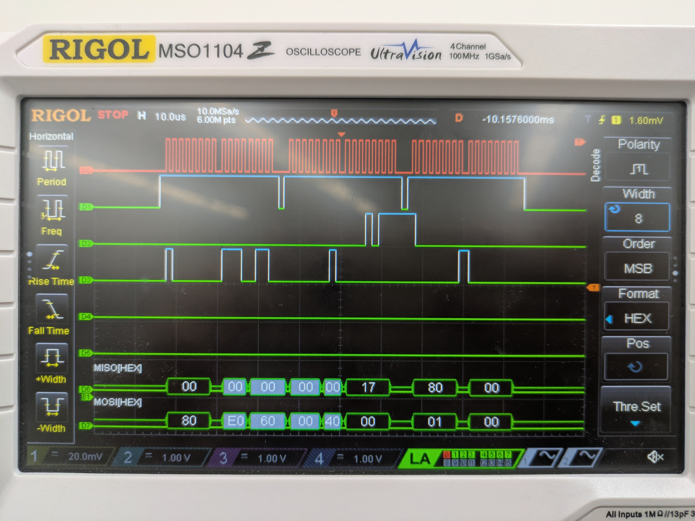
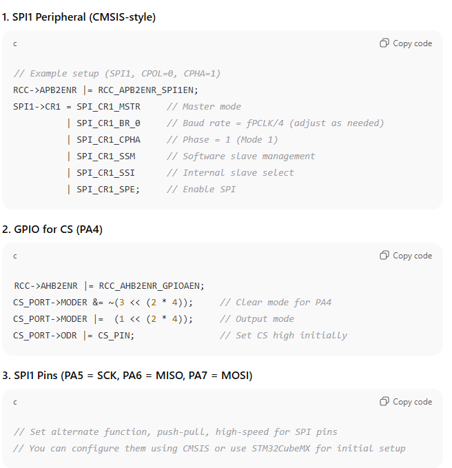

# Introduction 

Lab 6 is focused on setting up and using SPI and USART communication protocol on the MCU. USART was successfully used to communicate with the ESP8266, which was used to host a webpage at http://192.168.4.1/, and SPI was used to communicate with the DS1722 temperature sensor. The website was the interface with which a user is able to toggle an LED and select the resolution of the temperature reading, and was written in HTML.

# Design and Testing

## Code

For the USART, the Lab 6 starter code provided a great deal of the implementation. I only had to write an additional form for the webpage in HTML, and use the form information to program the DS1722, based on the specifications from the DS1722 datasheet. To communicate through SPI, there needed to be two functions: initSPI and spiSendRecieve, which were written using the specifications in the user manual. There also needed to be a function to decode the data recieved over SPI from the DS1722, which was also done based on how the data was formatted according to the DS1722 datasheet. 

## Hardware

The hardware for this lab was simple. There is already a port for the ESP8266 lab-provided boards, as seen in [this schematic](https://hmc-e155.github.io/assets/doc/E155%20Development%20Board%20Schematic.pdf), so it was simple to plug it in and use. The DS1722 had to be connected according to its pin out, and what functionality was desired (which was 4-wire SPI). The exact layout can be seen below in the schematic section. The pin assignment is as follows:

|  Function   | port   | pin |
|-------------|--------|-----|
| ChipSelect  |  PA4   | A3  |
| SCK         |  PA1   | A1  |
| CIPO        |  PB4   | D12 |
| COPI        |  PA12  | D2  |

The temperature sensor also had to be powered and grounded. 

# Technical Documentation

The code for this solution can be found [here](https://github.com/wchan03/e155Lab6), in the appropriate Git Repository

## Schematic 


# Results and Discussion 

The main thing to test for this lab was the SPI-- ensuring the intended values were being written to the DS1722, and then to ensure around the right value was coming back. To do so, I used the logic analyser to look at all the signals. First, I ensured that the signals coming from the MCU were correct-- writing the CS line high, then sending the configuration, and then polling for the temperature data, all while the SCK line was producing a clock. Once that was correct, I connected the DS1722, and I confirmed that I saw all the correct signals: the clock, chip select, and the CIPO and COPI lines. The values output by both the CIPO and COPI lines matched my expectations. This is seen below:



# Conclusion 

After testing the device using the oscilliscope and in real life, it works! I spent 35 hours on this lab. This is because the pins I orginally selected to use for the SPI functions do not work properly anymore (I fear I fried them a lab or two ago), and I did not realize for a long time. I assumed there was an error with the way I was initializing the SPI functionality on the MCU, but it was really a hardware issue.

# AI Prototype

## HTML Generation 

ChatGPT provided some helpful code for the HTML. It is definitley beyond my HTML abilites, which is nice to see. I think using an LLM would be useful for design things like this, especially considering I have enough code knowledge to be able to tweak things as I please. 

```{html}
<!DOCTYPE html>
<html lang="en">
<head>
  <meta charset="UTF-8" />
  <meta name="viewport" content="width=device-width, initial-scale=1.0"/>
  <title>Temperature Sensor Dashboard</title>
  <style>
    body {
      font-family: 'Segoe UI', sans-serif;
      background: #f4f6f8;
      display: flex;
      justify-content: center;
      align-items: center;
      height: 100vh;
      margin: 0;
    }

    .container {
      background: white;
      padding: 2rem 3rem;
      border-radius: 12px;
      box-shadow: 0 8px 20px rgba(0,0,0,0.1);
      text-align: center;
      width: 320px;
    }

    h1 {
      margin-bottom: 1rem;
      font-size: 1.6rem;
    }

    .temperature {
      font-size: 3rem;
      font-weight: bold;
      color: #ff6b6b;
      margin: 1rem 0;
    }

    .led-control {
      margin: 1.5rem 0;
    }

    .led-toggle {
      position: relative;
      display: inline-block;
      width: 60px;
      height: 30px;
    }

    .led-toggle input {
      opacity: 0;
      width: 0;
      height: 0;
    }

    .slider {
      position: absolute;
      cursor: pointer;
      top: 0; left: 0;
      right: 0; bottom: 0;
      background-color: #ccc;
      transition: 0.4s;
      border-radius: 30px;
    }

    .slider:before {
      position: absolute;
      content: "";
      height: 24px;
      width: 24px;
      left: 3px;
      bottom: 3px;
      background-color: white;
      transition: 0.4s;
      border-radius: 50%;
    }

    input:checked + .slider {
      background-color: #4caf50;
    }

    input:checked + .slider:before {
      transform: translateX(30px);
    }

    .precision-control {
      margin-top: 1rem;
    }

    select {
      padding: 6px;
      font-size: 1rem;
      border-radius: 5px;
      border: 1px solid #ccc;
    }

    .footer {
      margin-top: 1.5rem;
      font-size: 0.8rem;
      color: #888;
    }
  </style>
</head>
<body>
  <div class="container">
    <h1>Sensor Dashboard</h1>

    <div class="temperature" id="tempDisplay">-- °C</div>

    <div class="led-control">
      <label>LED Control</label><br />
      <label class="led-toggle">
        <input type="checkbox" id="ledSwitch">
        <span class="slider"></span>
      </label>
    </div>

    <div class="precision-control">
      <label for="precisionSelect">Precision:</label>
      <select id="precisionSelect">
        <option value="0">0 decimals</option>
        <option value="1">1 decimal</option>
        <option value="2" selected>2 decimals</option>
        <option value="3">3 decimals</option>
      </select>
    </div>

    <div class="footer">Updated <span id="timestamp">--:--:--</span></div>
  </div>

  <script>
    // Simulated backend polling function
    function getTemperatureFromSensor() {
      // Simulate temperature between 20°C and 30°C
      return 20 + Math.random() * 10;
    }

    let precision = 2;

    function updateTemperature() {
      const temp = getTemperatureFromSensor();
      const display = document.getElementById('tempDisplay');
      const timestamp = document.getElementById('timestamp');
      display.textContent = temp.toFixed(precision) + ' °C';

      const now = new Date();
      timestamp.textContent = now.toLocaleTimeString();
    }

    document.getElementById('precisionSelect').addEventListener('change', function() {
      precision = parseInt(this.value);
      updateTemperature(); // refresh immediately on change
    });

    document.getElementById('ledSwitch').addEventListener('change', function() {
      const state = this.checked ? "ON" : "OFF";
      // Call your backend here to control the LED
      console.log("LED switched", state);
      // Example: fetch('/api/led', { method: 'POST', body: JSON.stringify({ state }) })
    });

    // Initial update
    updateTemperature();
    // Update temperature every 5 seconds
    setInterval(updateTemperature, 5000);
  </script>
</body>
</html>

```


## C Code Generation

```{c}
#include "stm32l432xx.h"

// Define the Chip Select pin
#define CS_PORT    GPIOA
#define CS_PIN     GPIO_PIN_4

// Utility macros
#define CS_LOW()   (CS_PORT->ODR &= ~CS_PIN)
#define CS_HIGH()  (CS_PORT->ODR |= CS_PIN)

// Wait until TXE (Transmit buffer empty)
static void SPI1_WaitForTXE(void) {
    while (!(SPI1->SR & SPI_SR_TXE));
}

// Wait until RXNE (Receive buffer not empty)
static void SPI1_WaitForRXNE(void) {
    while (!(SPI1->SR & SPI_SR_RXNE));
}

// Wait until not busy
static void SPI1_WaitForNotBusy(void) {
    while (SPI1->SR & SPI_SR_BSY);
}

/**
 * @brief  Reads temperature from DS1722 over SPI
 * @retval float Temperature in degrees Celsius
 */
float DS1722_ReadTemperature(void) {
    uint8_t msb = 0, lsb = 0;

    // Start SPI transaction
    CS_LOW();

    // Send Read Temperature MSB Command (0x01)
    SPI1_WaitForTXE();
    *((__IO uint8_t *)&SPI1->DR) = 0x01;
    SPI1_WaitForRXNE();  // Dummy read for command write
    (void)SPI1->DR;

    // Send dummy byte to receive MSB
    SPI1_WaitForTXE();
    *((__IO uint8_t *)&SPI1->DR) = 0x00;
    SPI1_WaitForRXNE();
    msb = SPI1->DR;

    // Send dummy byte to receive LSB
    SPI1_WaitForTXE();
    *((__IO uint8_t *)&SPI1->DR) = 0x00;
    SPI1_WaitForRXNE();
    lsb = SPI1->DR;

    SPI1_WaitForNotBusy();
    CS_HIGH();

    // Convert to temperature
    float temp = (float)msb + ((lsb >> 7) * 0.5f);
    return temp;
}
```

ChatGPT also provided the necessary initialization code to put elsewhere: 



It structures the code into very distinct bits, which is probably useful and good practice. I couldn't get it to work, even with some light tweaking, so I can't endorse its reliability. And, it is not comprehensive of all the options for resolution, so it would not work for a real use case anyways. 