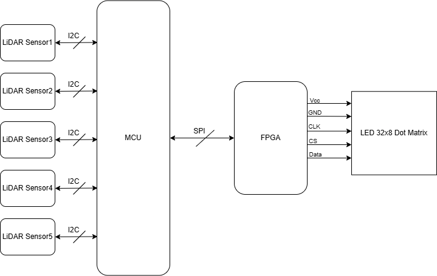
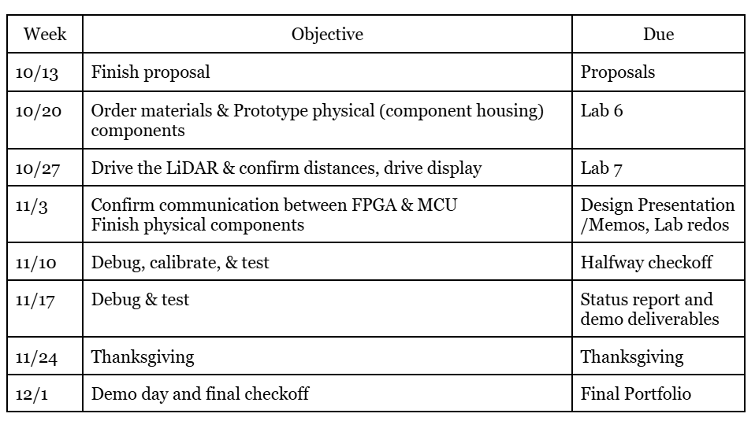
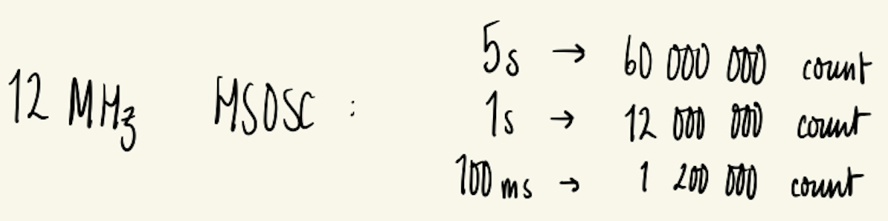
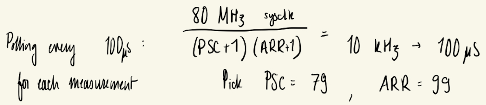
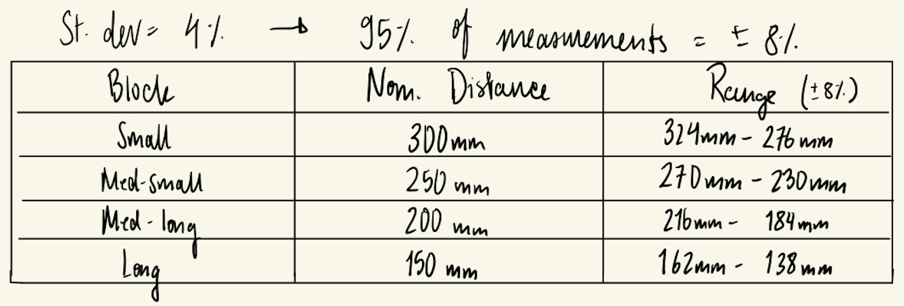

# Project Proposal

### Project Description & Overview 
The main objective of this project is to build a pattern-matching block game. A LCD, driven by the FPGA, will display a specified 2x2 pattern of icons, corresponding to physical blocks. Then, the player has to replicate that pattern on the game board. Over time, the period where the pattern is shown will decrease, increasing the difficulty of the game.

The main objective of this project is to build a rock-paper scissors game, where a human player plays against the computer. A LED Dot Matrix, driven by the FPGA, will display the computer’s play (rock, paper, or scissors), as well as any other pertinent information (score, countdown, etc). The player’s move will be picked up by a series of 5 LiDAR sensors. 
The five LiDAR sensors will be placed beneath the scanning platform and strategically positioned so that specific combinations of sensor activations correspond to particular game moves. The scanning platform will outline an area for players to position their hands, ensuring proper alignment and preventing misclassification of plays. Rock-paper-scissors provides three very distinct gestures 

Ensuring the LiDAR sensors work is the most crucial element (poses the highest risk) to the success of this project. The LiDARs are the main sensing mechanism that interfaces with the outside world, and their placement must be strategically optimized to consistently ensure that a player’s move is recognized. The design must ensure correct and consistent height classifications for the hand placements across a range of moves and player profiles. The design should also account for occasional missed reflections due to off-angle surfaces. Moreover, according to our trade study, the VL53L0X sensors can interfere with each other’s readings, requiring the design to time multiplex between the five sensors in retrieving the distance data. 

### Block Diagram

{width=50% fig-align="center"}

### Schedule and Division of Work

{width=50% fig-align="center"}

To portion the work, we will first create a shared github so we always have access to our main body of work. We will each take a task, and update the exact task week-by-week. It is important that we both gain experience with the LED Dot Matrix and the LiDAR, so we will both be aware of the development of the code, but more insight is gained in the debugging stage, so that is where we will prioritize working together.  

#### Time of Flight Sensors 
The Time-of-Flight (ToF) sensors are breakout boards housing the STM VL53L0X ToF IC. The sensors require 3.3V power and have a programmable i2c address, as well as an XSHUT (reset) pin. The sensors will be time multiplexed by active-low XSHUT signals, forcing only a single sensor to read at a time to prevent bus conflicts and IR interference. The sensors will follow the application schematic shown in Figure 3. of the user manual. The VL53L0X API will be downloaded and used to control and interface with the sensors.

FPGA Timing Calculations: Using the High Frequency Oscillator 
We want the FPGA to measure 5s, 1s, and multiples of 100µS to control the display. We will use the 12 MHz HSOSC clock and therefore require the following counters:

{width=60% fig-align="center"}

## MCU Design Details

For each sensor, we will follow the recommended 33 ms of reading time + 2 ms for extra buffer. The host will poll at 10 kHz for measurement status. With Sysclk = 80Mhz: PSC=79, ARR=99.

{fig-align="center"}

### MCU Design Details
To meet specifications the MCU will:
Properly sequence of stages in the game, including initialization
Produce a randomly generated pattern for each round
Read (time-multiplex) and verify the four LiDAR sensor inputs

The MCU will require 8 GPIO pins: 4 pins for LiDAR sensor XSHUT (one each), 1 pin for i2c communication with the LiDAR sensor, 1 pin for SPI communication with the FPGA, 1 pin for reset signal, 1 pin for PlayButton signal.

Upon reset, the MCU will send a signal to the FPGA to display the “Start Game” display and run all initialization code. It will remain in a while loop until PlayButton is pressed. 
Upon PlayButton, the MCU will count down 5 seconds and then generate a random pattern, sending this to the FPGA. The MCU will wait to receive a signal that the FPGA has displayed the pattern and allocated time for the player to place the blocks. 

Upon receiving this signal, the MCU will time multiplex between the four LiDAR sensors using the XSHUT pins, and store their readings. The readings will be compared to the pattern sent to the FPGA. If the patterns match, the game advances and the MCU generates a new random pattern, sending this to the FPGA. If the patterns do not match, the MCU will send a signal to the FPGA to display the “You Lost” display. The MCU will count how many successful rounds the player has achieved. If the player reaches 10 rounds, it will send a signal to the FPGA to display the “You Win” display.

Using the recommended 33ms scan time while indoors with a white target, we are given that the standard deviation is 4%. Therefore, 95% of measurements will fall within ±8% of the true distance. We will account for this with the following margins.

{fig-align="center"}

### Time of Flight Sensors
The Time-of-Flight (ToF) sensors are breakout boards housing the STM VL53L0X ToF IC. The sensors require 3.3V power and have a programmable i2c address, as well as an XSHUT (reset) pin. The sensors will be time multiplexed by active-low XSHUT signals, forcing only a single sensor to read at a time to prevent bus conflicts and IR interference. The sensors will follow the application schematic shown in Figure 3. of the user manual. The VL53L0X API will be downloaded and used to control and interface with the sensors.

### Bill of Materials

### Works Cited